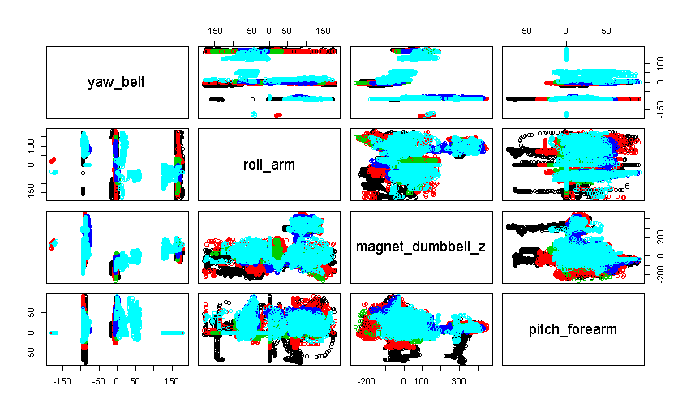

```{r setup, include=FALSE}
knitr::opts_chunk$set(echo = TRUE, eval = FALSE)
```

## Title: Classification Practice On Human Activity Reconization (HAR) Benchmark Dataset

#### Author: SH


### Synopsis/Overview 

Dataset "pml-training.csv" was provided by the instructor and was used to develop a classification model to identify the correctness of several human activities. Dataset "pml-testing.csv" (also provided) was used to blind-test the model performance. The data were readings from accelerometers on the belt, forearm, arm, and dumbell of 6 participants, as well as five different ways of barbell lifts exercise correctly and incorrectly (i.e., variable "classe").The focus of this exercise is to try various classification models and evaluate the results. Methods tried include regularized discriminant analysis (RDA), support vector machine (SVM), decision tree (RPART), naive Bayes (NB), boosting (GBM), and random forest (RF). Results suggest that for this dataset, classification via random forest method gives the cleanest classification, with an accuracy of 0.9947. 

The original dataset came from the "website: "http://groupware.les.inf.puc-rio.br/har (see the section on the Weight Lifting Exercise Dataset)".


### Classification Exercise: R Code and Illustrations


#### Data Description

Aside from information in the above session, training set and testing set both contain 160 variables including id, time, classification (for training data), and recordings from different part of the body. The training set has 19622 recordings; and the testing set has 20 observations.


```{r load}

# load packages
library(caret)
library(rpart)
library(e1071) # Naive Bayes
library(adabag)
library(AppliedPredictiveModeling)
library(rattle)
library(rpart.plot)
library(randomForest)

###
# load data
trainURL <- "https://d396qusza40orc.cloudfront.net/predmachlearn/pml-training.csv"
testURL <- "https://d396qusza40orc.cloudfront.net/predmachlearn/pml-testing.csv"

training <- read.csv(trainURL, na.strings=c("NA","#DIV/0!",""))
testing <- read.csv(testURL, na.strings=c("NA","#DIV/0!",""))
# str(training) # 19622 obs., 160 variables

```


#### Exploratory analysis/Preprocessing

The data sets were examined to evaluate the missing values, correlations among variables, near-zero-variance variables, and transformation. Irrelevant columns and variables with over half missing values were removed. While evidence shows certain correlations among variables, no further cleaning (e.g., removal of certain variables) was done for this assignment. Near-zero-variance check was passed. Preprocessing data via standardization does not seem to affect the classification outcome, perhaps this was done by default settings in the classification algarithms. This step produced datasets with 53 variables including "classe" (or "problem id").  


```{r cleaning}

# check NaN counts and remove columns with >=half NaN values
summary(training)
summary(testing)
na_cnt <- sapply(testing, function(x) {sum(is.na(x))})
na_colIdx <- which(na_cnt < length(testing[,1])/2)
tr <- training; # make a copy just in case ...
tr2 <- tr[,na_colIdx]
tr2 <- tr2[,-1:-2] # remove 1st and 2nd cols (rowNum, name)
# perform same treatment to testing set
te2 <- testing[,na_colIdx]
te2 <- te2[,-1:-2] # remove 1st and 2nd cols (rowNum, name)
# further remove irrelevant columns
tr2 <- tr2[,-1:-5]
te2 <- te2[,-1:-5]

# check nearzerovariance
nzv <- nearZeroVar(tr2, saveMetrics = TRUE)
nzv_idx <- which(nzv$nzv==TRUE)
nzv_idx # integer(0)
unique(nzv$nzv) # [1] FALSE
# so all seems good

```

An example of feature examination is visualized in Figure 1.

```{r fig1, fig.width=4, fig.height=4}

# matrix plots to explore correlation
op <- par(oma=c(5,7,1,1)) # save original setting
par(mar = rep(2, 4)) # try to fix "Error in plot.new() : figure margins too large
pairs(tr2[,c(3,14,39,41)], col = tr2$classe) 
par(op) # back to original setting

# include image without running the R code
# inline
# 

```


##### Figure 1. Correlation among a few feature variables


#### Classification

The original training data set was split 75-25 to a training (tr3) and a validation (te3) set, respectively. tr3 was used for model generation, while te3 was used for model evaluation. Methods tried include linear discriminant analysis (LDA), support vector machine (SVM), decision tree (RPART), naive Bayes (NB), boosting (GBM), and random forest (RF). Results suggest that nonlinear (and computation-expensive) models such as random forest give cleaner classification than linear model. Among models, random forest ranked top for this case, with an accuracy of 0.9947. 

```{r seed}

# fix random seed
set.seed(3333)

```

```{r split}

# split training set to training and validation sets
inTrain <- createDataPartition(y=tr2$classe, p = 0.75, list=FALSE)
# no standardization
tr3 <- tr2[inTrain,]
te3 <- tr2[-inTrain,]

```

Three methods, RDA, SVM, and RF, are shown with code below to give readers a flavor of different classification models. Briefly, RDA is a variant of the conventional linear discriminant analysis (LDA) with less attention needed to weed out variables of similar characteristics. SVM is another type of linear classification method. The difference between of LDA and SVM was discussed in https://www.quora.com/What-is-the-difference-between-SVM-and-linear-discriminant-analysis (last accessed June 17, 2016). Different from LDA, RDA, and SVM, RF is a nonlinear classification technique that requires intensive computation power. It is a collection of decision trees, each of them is generated from a random subset of the training data. With its difficult-to-interprete nature, it may suffer from overfit problem. For this exercise, the default settings of these algorithms were used and no further tuning was performed.

```{r fit}

# Regularized discriminant analysis (RDA)
ldaFit <- train(classe ~ ., data = tr3, method = "rda", control = trainControl(method = "cv"), verbose=FALSE);
print(ldaFit)
# testing
ldaPred <- predict(ldaFit, te3)
confusionMatrix(ldaPred, te3$classe)
# Accuracy : 0.8966  # Kappa : 0.8696

# Support vector machine (SVM)
svmFit <- svm(classe ~., data = tr3)
svmPred <- predict(svmFit, te3, type = "class")
confusionMatrix(svmPred,te3$classe)
# Accuracy : 0.9492  # Kappa : 0.9357

# Random forest (rf)
rfFit <- randomForest(classe ~., data = tr3)
print(rfFit)
rfPred <- predict(rfFit, te3, type = "class")
confusionMatrix(rfPred,te3$classe)
# Accuracy : 0.9947  # Kappa : 0.9933

```

Results from the random forest algorithm seemed to give best performance. However, it is difficult to  evaluate whether the potential overfitting issue without further investigation. Nevertheless, the random forest model was used for the blind test of the prescribed testing data set.


#### Blind Test

Blind test was performed on preprocessed data te2 using RDA, SVM, and RF models. It appears that classification results of three models were consistent except for problem_id#1 (A from RDA vs. B from SVM and RF).

```{r test}

# preprocess testing data then test
te2Pred_lda <- predict(ldaFit, te2, type = "raw")
te2Pred_lda
# [1] A A B A A E D B A A B C B A E E A B B B
te2Pred_svm <- predict(svmFit, te2, type = "class")
te2Pred_svm
 # 1  2  3  4  5  6  7  8  9 10 11 12 13 14 15 16 17 18 19 20 
 # B  A  B  A  A  E  D  B  A  A  B  C  B  A  E  E  A  B  B  B 
te2Pred_rf <- predict(rfFit, te2, type = "class")
te2Pred_rf
#  1  2  3  4  5  6  7  8  9 10 11 12 13 14 15 16 17 18 19 20 
#  B  A  B  A  A  E  D  B  A  A  B  C  B  A  E  E  A  B  B  B 
# Levels: A B C D E

# Note that classification results are the same for all but one (problem_id#1) test sample.

```

#### Out of Sample Error

Available accuracy and Kappa (respectively) for the models tried are: RDA (0.8966, 0.8696), Rpart (0.7455, 0.6763), NB (0.4971, 0.3809), SVM (0.9492, 0.9357), and random forest (0.9947, 0.9933)

### Summary

The results of the above exercise indicate that random forest has by far the best performance among these models for this training set. Further investigation is needed to investigate whether overfitting occurs. For the testing data set, classification results of the above three models are consistent except for problem_id#1 (A from RDA vs. B from SVM and RF).
